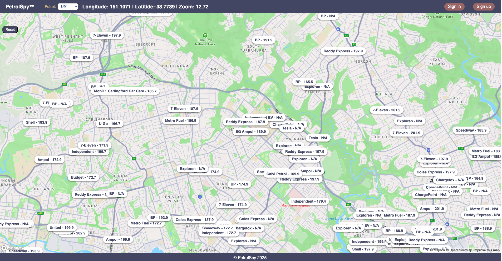
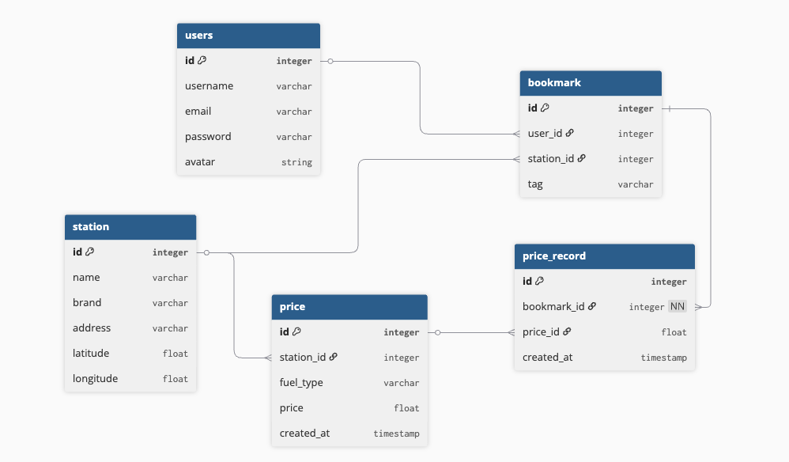
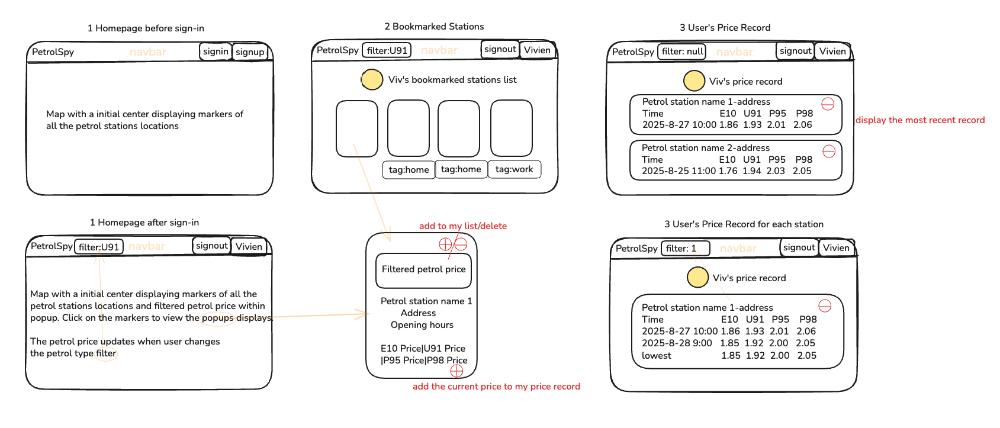
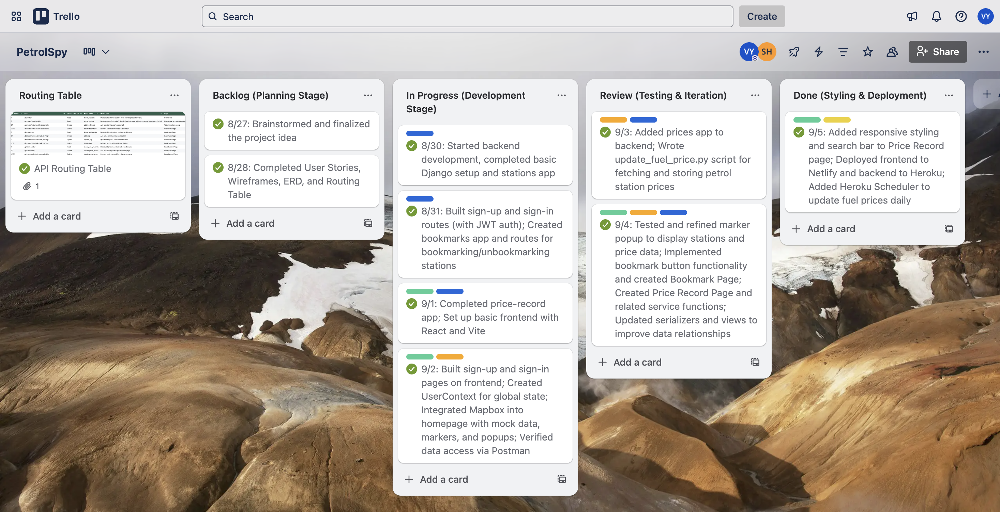

# Petrol Spy 🕶️

Description: Petrol Spy is a full-stack web application that helps users track real-time petrol prices and manage their favorite stations.

Users can browse all petrol stations and their prices without signing up or logging in.  
They can freely drag and zoom the interactive map to explore different areas, the navbar dynamically displays the current longitude, latitude, and zoom level, updating in real-time as the user moves the map.

The navbar also includes a petrol filter, allowing users to select the fuel type they care about most. The map markers immediately update to display prices for the selected fuel type, no need to click into each marker.

Users can click on any marker to open a popup showing detailed station information, including brand, name, address, and prices for every available fuel type.

Once logged in, users can bookmark their frequently visited stations and view them on a dedicated Bookmark Page.  
From there, users can create “price snapshots” of bookmarked stations and save them to the Price Record Page. This allows them to build a price history and make data-driven decisions about when to refuel.



## Deployment link

https://petrolspy.netlify.app/

## Getting Started / Code Installation

Follow these steps to run the project locally:

1. Clone the repository

   `git clone https://github.com/bihuiy/petrol-spy-frontend.git`

   `cd petrol-spy-frontend`

2. Install dependencies `npm install`

3. Set up environment variables

   Create a .env file in the root directory and add the following variables:

   `VITE_API_URL=https://petrolspy-8255c7196974.herokuapp.com`

   `VITE_MAPBOX_ACCESS_TOKEN=pk.eyJ1Ijoidml2aWVueWFuZzciLCJhIjoiY21ldTFlcG9jMDJjbzJpcHhhNDZyazB4bCJ9.ppKZ38utyXfhG-PG8E7fZw`

   `VITE_CLOUDINARY_URL=https://api.cloudinary.com/v1_1/dnycwkg4c/image/upload`

   `VITE_UPLOAD_PRESET=petrolspy`

4. Start the development server `npm run dev`

Open http://localhost:5173 to view the app in your browser.

## Timeframe & Working Team (Solo/Pair/Group)

This project was completed individually over one week, from 27th August to 5th September 2025.

## Technologies Used

**Front End**

- React (with React Router for client-side routing)
- React Hooks (useState, useEffect, useContext for state management)
- Vite (fast development build tool)
- Axios (for making API requests)
- Mapbox GL JS (for interactive map rendering)
- React Icons (for UI icons)
- CSS & Responsive Design (media queries for mobile and desktop)

**Back End**

- Django (Python web framework)
- Django REST Framework (for building RESTful APIs)
- Django ORM (for database queries)
- Django Environ (for managing environment variables)
- PostgreSQL (relational database)
- Neon
- Django CORS Headers (for handling cross-origin requests)
- Django Authentication (user sign-in/sign-up)
- Integration with external Petrol Price API (fetching real-time petrol prices)
- Deployed on Heroku (using Gunicorn as WSGI server)

**Development Tools**

- VS Code (code editor)
- Git & GitHub (version control & repository hosting)
- Postman (API testing)
- Heroku CLI (for deployment)

## Brief

Petrol Spy is a Django CRUD application developed as a personal project. I pass by a petrol station near my home every day, which allows me to observe daily fuel price changes. Over time, I noticed that prices are often at their lowest either at the beginning or the end of the month. However, whenever I wanted to compare today’s price with last week’s or last month’s price, I found it hard to remember the exact numbers. I even had to manually note them down on my phone.

This inspired me to build an application that allows users to:

- View daily petrol prices in one place

- Bookmark their frequently visited petrol stations

- Save screenshots of current prices for easy comparison with future prices

As a result, my app naturally includes:

- Homepage to display all stations and their prices

- Bookmark Page to show a user’s saved stations

- Price Record Page to keep track of saved petrol prices for comparison

## Planning

During the planning phase, I focused on clearly defining the project scope, data structure, and UI layout before writing any code.

### 1. User Stories

I started by writing user stories to clarify what features the app needed and who would use them.

> As a user, I want to visit the homepage without logging in so that I can understand what this app is about before deciding to sign up.
>
> As a user, I want to easily sign up and log in so that I can access personalized features.
>
> As a user, I want to log out to protect my account when I'm done using the platform.
>
> As a logged-in user, I want to search for my area or postcode on the map, so that I can quickly see nearby petrol station markers and their price information.
>
> As a logged-in user, when I click on a petrol station popup, I want to see the price, station name, address, and opening hours.
>
> As a logged-in user, I want to bookmark petrol stations that I frequently visit, so that I can quickly check their prices the next time I open the app.
>
> As a logged-in user, I want to delete petrol stations from my bookmarks if I no longer need them.
>
> As a logged-in user, I want to add tags or notes to my bookmarked petrol stations, such as “near home,” “near work,” or “cheapest,” so that I can record my preferences.
>
> As a logged-in user, I want to edit or remove the tags or notes I added to my bookmarked petrol stations.
>
> As a logged-in user, I want to record the current price of a petrol station into a price history record, so that I can see whether the price has gone up or down.

### 2. ERD (Entity-Relationship Diagram)

I designed the database schema early on, identifying the key entities (users, stations, price, bookmarks, price_records) and their relationships.



### 3. Routing Table

I mapped out all API endpoints to ensure a consistent RESTful design.

| Route                                | Method | CRUD Operation | Description                                    |
| ------------------------------------ | ------ | -------------- | ---------------------------------------------- |
| `/stations/`                         | GET    | Read           | List all stations                              |
| `/stations/<station_id>/bookmark/`   | POST   | Create         | Add a station to user's bookmark               |
| `/stations/<station_id>/bookmark/`   | DELETE | Delete         | Remove a station from user's bookmark          |
| `/bookmarks/`                        | GET    | Read           | Display all bookmarked stations by this user   |
| `/bookmarks/<bookmark_id>/tag/`      | PUT    | Update         | Update/add a tag for a bookmarked station      |
| `/bookmarks/<bookmark_id>/tag/`      | DELETE | Delete         | Delete a tag for a bookmarked station          |
| `/price-records/`                    | GET    | Read           | Display all price records created by this user |
| `/price-records/`                    | POST   | Create         | Add a realtime price to price record page      |
| `/price-records/<price-records_id>/` | DELETE | Delete         | Remove a price record from the record page     |

### 4. Wireframes



### 5. Trello Board

I used **Trello** to track my daily tasks and manage the overall progress of this project.

Below is a screenshot of my Trello board, which includes columns for **To Do**, **In Progress**, **Review**, and **Done**.

- **Backlog:** Project ideas, sketches, planning documents
- **In Progress:** Current coding tasks
- **Review:** Features under testing and debugging
- **Done:** Completed features ready for deployment

Below is an overview of my development timeline mapped to these stages:



> A detailed day-by-day breakdown of the development process can be found in the **Build/Code Process** section below.

## Build / Code Process

Below is my detailed day-by-day breakdown of the development process, which I originally documented on my Trello board.

### Backlog (Planning Stage)

- 8/27: Brainstormed and finalized the project idea
- 8/28: Completed **User Stories**, **Wireframes**, **ERD**, and **Routing Table**

### In Progress (Development Stage)

- 8/30: Started backend development, completed basic Django setup and **stations app**
- 8/31:
  - Built **sign-up** and **sign-in** routes (with JWT auth)
  - Created **bookmarks app** and routes for bookmarking/unbookmarking stations
- 9/1:
  - Completed **price-record app**
  - Set up basic **frontend** with React and Vite
- 9/2:
  - Built **sign-up** and **sign-in** pages on frontend
  - Created **UserContext** for global state
  - Integrated Mapbox into homepage with mock data, markers, and popups <sup>[code snippet 1: Dynamic Map Bounds Query]</sup>
  - Verified data access via **Postman**

### Review (Testing & Iteration)

- 9/3:
  - Added **prices app** to backend <sup>[code snippet 2: Separate Price Model]</sup>
  - Wrote `update_fuel_price.py` script for fetching and storing petrol station prices
- 9/4:
  - Tested and refined **marker popup** to display stations and price data
  - Implemented bookmark button functionality and created **Bookmark Page**
  - Created **Price Record Page** and related service functions <sup>[code snippet 3: `select_related` Optimization]</sup>
  - Updated serializers and views to improve data relationships

### Done (Styling & Deployment)

- 9/5:
  - Added responsive **styling** and **search bar** to Price Record page
  - Deployed frontend to **Netlify** and backend to **Heroku**
  - Added **Heroku Scheduler** to update fuel prices daily

### Code Snippets

1. Dynamic Map Bounds Query:

**Goal:** Fetch new station data whenever the user pans or zooms the map, so we only load stations within the current visible area.

I was inspired by the [Add Dynamic Markers and Popups to a Map in a React app](https://docs.mapbox.com/help/tutorials/dynamic-markers-react/?step=0). Instead of using a dataset that already supports geographic queries (like in this Mapbox tutorial), I implemented my own bounding box filter.

#### Frontend (React)

```js
// Get current map bounds and fetch stations within the bounding box
const getBboxAndFetch = useCallback(async () => {
  const bounds = mapRef.current.getBounds();
  const bbox = [
    bounds.getWest(),
    bounds.getSouth(),
    bounds.getEast(),
    bounds.getNorth(),
  ].join(","); // Convert array to comma-separated string

  try {
    const { data } = await stationIndex(bbox); // API call with bbox as query param
    setStationData(data);
  } catch (error) {
    setError(error);
  }
}, []);
```

#### Backend (Django REST Framework)

```python
# GET /stations?bbox=left,bottom,right,top
def get(self, request):
    bbox = request.query_params.get("bbox", None)
    if bbox:
        left, bottom, right, top = map(float, bbox.split(","))
        stations = Station.objects.filter(
            longitude__gte=left,
            longitude__lte=right,
            latitude__gte=bottom,
            latitude__lte=top,
        ).prefetch_related("prices")
    else:
        stations = Station.objects.all().prefetch_related("prices")

    serialized_stations = StationSerializer(stations, many=True)
    return Response(serialized_stations.data)
```

2. Separate Price Model

**Goal:** Because petrol stations can have varying fuel types (e.g., some do not offer U91), I decided to separate pricing information from the Station model. I created a dedicated Price model that stores the fuel_type and price, and relates back to Station through a ForeignKey. This allows each station to have a flexible set of prices.

```python
class Price(models.Model):
    station = models.ForeignKey(
        to="stations.Station", on_delete=models.CASCADE, related_name="prices"
    )
    fuel_type = models.CharField(max_length=20)
    price = models.DecimalField(max_digits=5, decimal_places=1)
    last_updated = models.DateTimeField(auto_now=True)

    def __str__(self):
        return f"{self.station.name} - {self.fuel_type} - {self.price}"
```

3. `select_related` Optimization:

**Goal:** In my design, users can bookmark any station from the homepage and then create or screenshot price records from the bookmark page. Since the Price Record page needs to display detailed information about the related station, the PriceRecord model has a ForeignKey relationship to Bookmark.

To optimize performance, I used select_related in the view to eagerly load the related bookmark object for each price record. This reduces the number of database queries when fetching price records and improves efficiency.

```python
# Index route - display all price records created by this user
def get(self, request):
    user = request.user
    price_records = PriceRecord.objects.filter(owner=user).select_related("bookmark")
    serialized_price_records = PriceRecordSerializer(price_records, many=True)
    return Response(serialized_price_records.data)
```

When creating a PriceRecord, the frontend only needs to send the id of the associated Bookmark, and DRF will correctly associate it with the corresponding Bookmark object. Also with a nested BookmarkSerializer, bookmark_detail provides all the details of the associated Bookmark, not just its id, which makes it easier for the frontend to display complete information.

```python
class PriceRecordSerializer(serializers.ModelSerializer):
    bookmark = serializers.PrimaryKeyRelatedField(queryset=Bookmark.objects.all())
    bookmark_detail = BookmarkSerializer(source="bookmark", read_only=True)

    class Meta:
        model = PriceRecord
        fields = "__all__"
```

## Challenges

One of the biggest technical challenges I faced was learning how to access and integrate the free Petrol Stations API provided by [NSW Government](https://api.nsw.gov.au/Product/Index/22).

After subscribing and registering my app, I obtained an API Key, API Secret, and Authorization Header, which allow me to make up to 2500 calls per month for free. Then I located the URL endpoints that provide the station information and price data I needed, and started figuring out how to fetch data from them.

I experimented by filling in all the required parameters (Authorization, Content-Type, apikey, transactionid, requesttimestamp) in the request headers for the URL endpoint. It worked, I was able to successfully access and download the data file. Next, I learned how to use Python’s native requests module and add my own custom headers to fetch data. I refactored this into a function and verified in Postman that the request was working as expected.

After I could successfully retrieve the data, I decided to store all the station and price data in my own Neon database (with a stations table and a prices table). This way, the frontend can fetch data directly from my database instead of repeatedly calling the public API, which improves performance, avoids API call limits, and gives me full control over the data.

Later, I discovered another API endpoint that returns all new current prices. I wrote a second function and a standalone Python script whose sole job is to query all new current prices and update the data in my database. I then configured Heroku Scheduler, as recommended by my instructor Sam, to run this script automatically on a regular basis, so my price data stays up to date without manual intervention.

```python
# Get the latest prices
def update_prices():

    update_prices_url = f'{env("API_BASE_URL")}{env("UPDATE_PRICES_URL")}'
    access_token = get_access_token()
    transaction_id = datetime.now().strftime("%Y%m%d%H%M%S%f")
    timestamp = datetime.now().strftime("%d/%m/%Y %I:%M:%S %p")
    headers = {
        "Authorization": f"Bearer {access_token}",
        "Content-Type": "application/json; charset=utf-8",
        "apikey": env("API_KEY"),
        "transactionid": transaction_id,
        "requesttimestamp": timestamp,
    }
    res = requests.get(update_prices_url, headers=headers)
    res_data = res.json()
```

## Wins: Button Performance Optimization

After deploying the project, I noticed that the bookmark/unbookmark button was extremely slow. In particular, the Bookmark page did not immediately reflect changes when unbookmarking a station.

Analysis: Initially, I built the BookmarkButton component to handle bookmarks within the map markers. Later, I started integrating it into the Bookmark page. At that time, I didn’t take a higher level view of the state management. As a result:

- Both BookmarkButton and BookmarkPage had their own useEffect to fetch bookmarks and separate local states (bookmarks and setBookmarks).
- The BookmarkButton only updated its own local state, which was not passed back to the BookmarkPage.
- Therefore, when a user clicked unbookmark, the BookmarkButton state changed, but the BookmarkPage state didn’t, so the page still displayed the old list.
- The update only appeared after refreshing the page (re-running the useEffect).

Solution & Result:
To fix this, I moved bookmarks and setBookmarks to a shared BookmarkContext:

- Clicking a BookmarkButton now directly updates the context.
- BookmarkPage consumes the same context, so React automatically re-renders it.
- This ensures that unbookmarked items disappear from the page immediately, greatly improving the user experience and responsiveness.

```js
import { createContext, useContext, useEffect, useState } from "react";
import { UserContext } from "./UserContext";
import { bookmarkIndex } from "../services/bookmarkService";

const BookmarkContext = createContext();

const BookmarkProvider = ({ children }) => {
  // * State
  const [bookmarks, setBookmarks] = useState([]);
  const [isLoading, setIsLoading] = useState(false);
  const [error, setError] = useState(null);
  // * Context
  const { user } = useContext(UserContext);

  useEffect(() => {
    const getBookmarkData = async () => {
      if (!user) return;
      setIsLoading(true);
      try {
        const { data } = await bookmarkIndex();
        setBookmarks(data);
      } catch (error) {
        setError(error);
      } finally {
        setIsLoading(false);
      }
    };
    getBookmarkData();
  }, [user]);

  return (
    <BookmarkContext.Provider
      value={{ bookmarks, setBookmarks, isLoading, error }}
    >
      {children}
    </BookmarkContext.Provider>
  );
};

export { BookmarkContext, BookmarkProvider };
```

## Key Learnings / Takeaways

Through this project, I gained both technical skills and deeper insights into the development process. On the technical side, I became more confident with nested serializers in Django for handling complex data relationships, and learned how to lift state to a React Context to share state across multiple components efficiently. I also designed a separate price app to manage petrol types and prices, which improved the clarity and maintainability of the backend structure.

On the process and engineering mindset side, I realized that frontend and backend development require constant communication. Even with a detailed plan, implementing frontend features often revealed details that affected the backend, prompting ongoing discussions and adjustments. This experience taught me the importance of iterative problem-solving, and aligning both sides of the system to build a smooth and maintainable application.
